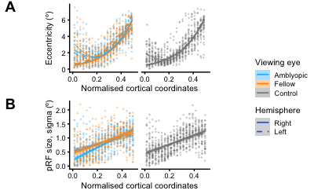
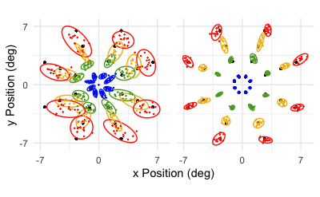

# Data and Materials

denis schluppeck, 2025

Data files and code for creating figures in Schluppeck et al (2025) Vision Research manuscript.

- [Link to the paper](https://www.sciencedirect.com/science/article/pii/S0042698925001385) online
- Link to the [github repo](https://github.com/schluppeck/schluppeck-et-al-2025)
- ... and [github pages](https://schluppeck.github.io/schluppeck-et-al-2025/): https://schluppeck.github.io/schluppeck-et-al-2025/


## Notes

- Most of our fMRI data analysis was done in Matlab, but to bring behaviour and summary stats together, we used `R` (and `ggplot2` and tidyverse friends for making clean visualisations). To run the code, you'll have to make sure you install the following packages and their dependencies:

```R
pkgs <- c('buildmer',
'broom','cetcolor',
'cowplot','effects',
'effectsize','flextable',
'ggridges','gtsummary',
'janitor','lme4',
'lmerTest','measurements',
'officer','tidyverse')
install.packages(pkgs)
```

- the `r` file called `2025_make_amblyopia_summary_figures.R` contains code to make all data figures in the manuscript. 

For example, the figures in the paper that summarise eccentricity as a function of cortical distance



- The code here makes uses an intermediate summary file `2025-03-fit-data-summary.csv` to do the final summary. Its columns are:

| Column name| Description |
|------------|-------------|
|subName | participant initials|
|sub | participant # |
|kind | (A)blyope or (C)ontrol |
|hemi | L or R hemisphere|
|whichEye | as measured through AE - amblyopic eye / FE - fellow eye|
|eCoords | normalised cortical coordinates (after Benson et al) |
|eData | measured eccentricity from pRF fit |
|rfData | measurd pRF size from pRF fit |
|r2Data | corresponding average r2 value for goodness of fit |


- the `behaviour` sub-folder contains code and per-participant psychophysics data for making the figures visualising and quantifying the behavioural data.
