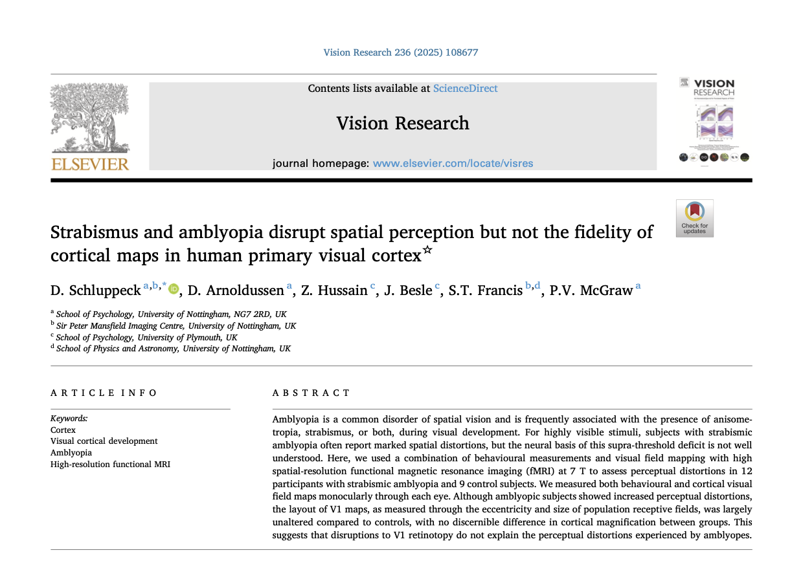

# Companion repo for Schluppeck et al (2025) Vision Research manuscript



denis schluppeck, 2025

Data files and code for creating figures in Schluppeck et al (2025) Vision Research manuscript.

## Data and Materials

- [Link to the paper](https://www.sciencedirect.com/science/article/pii/S0042698925001385) online
- Link to the [github repo](https://github.com/schluppeck/schluppeck-et-al-2025)
- ... and [github pages](https://schluppeck.github.io/schluppeck-et-al-2025/): https://schluppeck.github.io/schluppeck-et-al-2025/


## Notes

### Analysis tools

Most of our fMRI data analysis (pre-processing, pRF fitting, map visualisation, etc.) was done in Matlab using `mrTools` (https://github.com/justingardner/mrTools), but to bring behaviour and summary stats together, we used `R` (and `ggplot2` and `tidyverse` friends for making clean visualisations). To run the code, you'll have to make sure you install the following packages and their dependencies:

```R
# define list of packages to install
pkgs <- c('buildmer',
'broom','cetcolor',
'cowplot','effects',
'effectsize','flextable',
'ggridges','gtsummary',
'janitor','lme4',
'lmerTest','measurements',
'officer','tidyverse')

# install them
install.packages(pkgs)
```

We used a recent version of R and dependencies for analysis, so this should hopefully all work.

```R
> version
               _                           
platform       aarch64-apple-darwin20      
arch           aarch64                     
os             darwin20                    
system         aarch64, darwin20           
status                                     
major          4                           
minor          4.0                         
year           2024                        
month          04                          
day            24                          
svn rev        86474                       
language       R                           
version.string R version 4.4.0 (2024-04-24)
nickname       Puppy Cup   
```

### Code for data figures

The `r` file called `2025_make_amblyopia_summary_figures.R` contains code to make all data figures in the manuscript. 

For example, the figures in the paper that summarise eccentricity as a function of cortical distance were made with this code:


### Intermediate data summary file

The code here makes uses an intermediate summary file `2025-03-fit-data-summary.csv` to do the final summary. Its columns are:

| Column name| Description |
|------------|-------------|
|subName | participant initials|
|sub | participant # |
|kind | (A)blyope or (C)ontrol |
|hemi | L or R hemisphere|
|whichEye | as measured through AE - amblyopic eye / FE - fellow eye|
|eCoords | normalised cortical coordinates (after Benson et al) |
|eData | measured eccentricity from pRF fit |
|rfData | measurd pRF size from pRF fit |
|r2Data | corresponding average r2 value for goodness of fit |

### Behavioural data plots

The `behaviour` sub-folder contains code and per-participant psychophysics data for making the figures visualising and quantifying the behavioural data.


